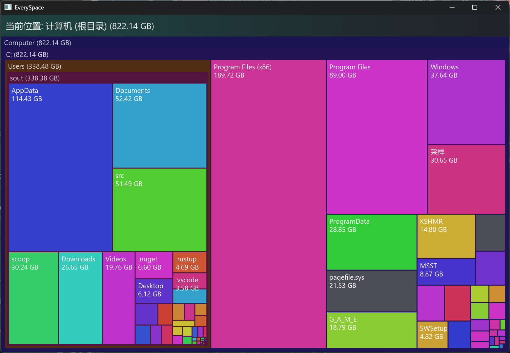

# every_space

A disk space analyzer

High performance (maybe)

I used [rayon](https://github.com/rayon-rs/rayon) for parallel computing, which in most cases can shorten the computing speed, but it may also cause excessive CPU usage

## Usage

Export CSV from Everything

Then import

## Omg

[iced](https://github.com/iced-rs/iced) is so fucking good that i can keep my ui almost above 200fps...
